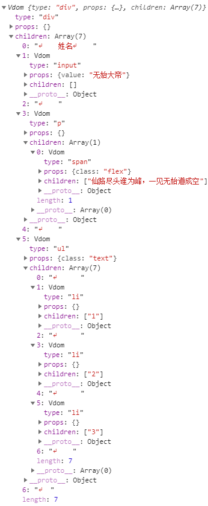
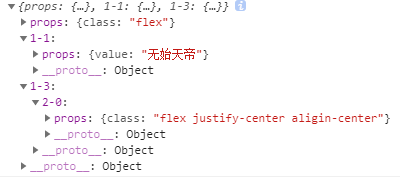

# 动手实现个简易版的虚拟dom以及diff算法

借鉴于：
1. https://juejin.im/post/5c8e5e4951882545c109ae9c
2. <a href="https://github.com/Matt-Esch/virtual-dom">virtual-dom</a>

## 测试/test
```
npm install
npm run dev
```

## 难点
1. 主要是与DOM有关的api不熟，只能面向MDN查找。不过即使对api不熟，实现一遍也是很好的，比看那些文章却不明其理要好，直接动手实现多好。
2. diff算法不理解，只好中途先去学习<a href="https://github.com/Matt-Esch/virtual-dom">virtual-dom</a>库的源码，主要是结合示例去跑了一遍。



