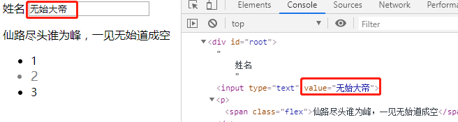
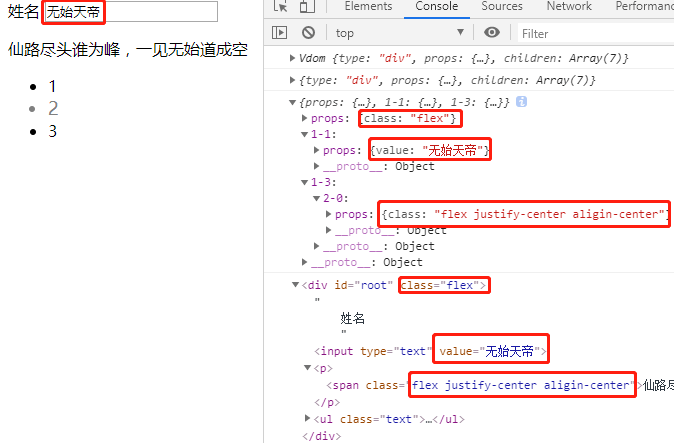

# 动手实现个简易版的虚拟dom以及diff算法

借鉴于：
1. https://juejin.im/post/5c8e5e4951882545c109ae9c
2. <a href="https://github.com/Matt-Esch/virtual-dom">virtual-dom</a>

## 测试/test
```
npm install
npm run dev
```

## 注意
1. diff.js和patch.js是我自己设计的第一种diff，他两配合用
2. vdom-diff.js和diff-props.js以及vpatch.js是我仿照virtual-dom设计的第二种diff方法，可以将所有的patch平铺到一个对象里，这样更新时省去了递归patches对象
3. 代码内都有注释，记录了我的思考

## 难点
1. 主要是与DOM有关的api不熟，只能面向MDN查找。不过即使对api不熟，实现一遍也是很好的，比看那些文章却不明其理要好，直接动手实现多好。
2. diff算法不理解，只好中途先去学习<a href="https://github.com/Matt-Esch/virtual-dom">virtual-dom</a>库的源码，主要是结合示例去跑了一遍。
3. patch方法应用更新有点小烦
4. diff.js是我自己写的diff，和virtual-dom库以及网上参考文章有较大区别；通过递归确定差异与层级，如果是children内部的差异，我会将层级和children的下标组合成键名，对应的差异作为键值存入对象中，但是如果新vdom结构有所改变，即节点都变了，我这就没有考虑了。
5. vdom-diff.js则是符合virtual-dom库以及网上参考文章的diff方法了。这里需要把所有层级的差异全都平铺到一个大对象中，所以必须要保证键名不冲突，那么内部的`index`必须不断自增！

## 看图说话

### 旧dom节点：



### 旧dom节点对应的vdom结构：


### 应用diff方法后得到的diffs对象：


### 应用patch方法更新后的dom节点：

